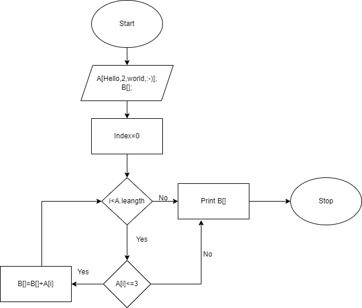

Итоговая работа

Добавляем блок-схему 

Создаем новую консоль в терминале пишем dotnet new console

Пишем программу для решения задачи: Написать программу, которая из имеющегося массива строк формирует новый массив из строк, длина которых меньше, либо равна 3 символам. Первоначальный массив можно ввести с клавиатуры, либо задать на старте выполнения алгоритма. При решении не рекомендуется пользоваться коллекциями, лучше обойтись исключительно массивами.

Тест программы прошел успешно